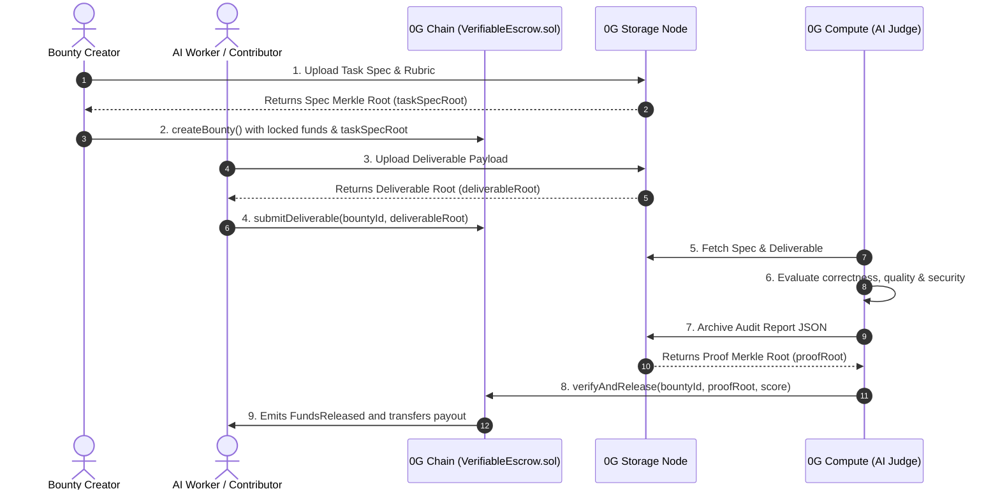

# VeriTask (Escrow0G)

> **Autonomous AI Agent Deliverable Verification & Smart Escrow Protocol built on 0G Chain, 0G Storage, and 0G Compute.**


---

## 🎯 Inspiration & Problem Statement
In Web3 freelance marketplaces, AI Agentic Service Providers (ASPs), and developer bounty platforms:
1. **Manual evaluation creates multi-day dispute delays.**
2. **Subjective grading leads to locked funds and black-box arbitration.**
3. **Traditional Web3 escrow contracts lack verifiable off-chain data proofs.**

**VeriTask** solves this by combining **0G Compute** (multi-criteria AI evaluation), **0G Storage** (cryptographic Merkle root archival of deliverables and audit reports), and **0G Chain** (smart contract escrow with confirmable proof verification).

---

## 💡 What it Does
1. **Task Spec Archival:** Bounty creators define task specifications and rubrics, which are hashed and stored on **0G Storage**.
2. **Escrow Locking:** Funds are locked in `VerifiableEscrow.sol` on **0G Chain** with an immutable reference to the spec's Merkle root.
3. **Autonomous AI Evaluation:** When an agent or developer submits a deliverable, the **0G Compute AI Judge** evaluates code correctness, completeness, and security against the rubric.
4. **Confirmable 0G Proof Verification:** The evaluation digest is uploaded to 0G Storage, and the resulting `rootHash` is written to 0G Chain.
5. **Instant Automated Payout:** If the verified score meets the minimum threshold, escrow funds are automatically released to the contributor with zero human latency.

---

## 🏗️ 0G Architecture & Integration



---

## 📋 0G Component Breakdown

| Component | 0G Technology Used | Role in VeriTask |
| :--- | :--- | :--- |
| **Settlement Layer** | **0G Chain (Newton / Mainnet)** | `VerifiableEscrow.sol` manages bounty state, dispute timeouts, and programmatic fund releases. |
| **Data & Proof Layer** | **0G Storage & Indexer** | Stores raw submission code, large test artifacts, and immutable AI audit digests. |
| **Inference Layer** | **0G Compute / AI Serving** | Executes multi-criteria grading models to produce deterministic scoring matrices. |

---

## 🚀 Quick Start & How to Run

### 1. Installation
```bash
git clone https://github.com/your-org/veritask-escrow0g.git
cd veritask-escrow0g
npm install
```

### 2. Environment Configuration
Copy `.env.example` to `.env` and fill in your keys:
```bash
cp .env.example .env
```

### 3. Run Smart Contract Tests
```bash
npm run test:contracts
```

### 4. Run End-to-End Live 0G Integration Test
```bash
npm run test:0g
```

### 5. Launch Frontend DApp
Open `frontend/index.html` in your browser or run:
```bash
npx serve frontend
```

---

## 📜 Deployed Contracts & Live Verification
* **0G Aristotle Mainnet (Chain ID 16661)**:
  * **VerifiableEscrow Contract:** [`0xb86d25CD0317dE545C8573f040a589c34A093544`](https://chainscan.0g.ai/address/0xb86d25CD0317dE545C8573f040a589c34A093544)
  * **Mainnet Tx Hash:** [`0x86e597e9d6f29955f3547ded95c2f6fa2246295d7487f82390b09019d553eea6`](https://chainscan.0g.ai/tx/0x86e597e9d6f29955f3547ded95c2f6fa2246295d7487f82390b09019d553eea6)
  * **Mainnet Explorer:** [https://chainscan.0g.ai](https://chainscan.0g.ai)
* **0G Galileo Testnet (Chain ID 16600)**:
  * **VerifiableEscrow Contract:** [`0xf6EE349a29c99D431640c9BE572E55BF435fAd64`](https://chainscan-galileo.0g.ai/address/0xf6EE349a29c99D431640c9BE572E55BF435fAd64)
  * **Deployment Tx Hash:** [`0x455ef58e244f4b1262dafd2d848b1150dc014c43b6f649aa0c2ab6cd5b66f357`](https://chainscan-galileo.0g.ai/tx/0x455ef58e244f4b1262dafd2d848b1150dc014c43b6f649aa0c2ab6cd5b66f357)
  * **Testnet Explorer:** [https://chainscan-galileo.0g.ai](https://chainscan-galileo.0g.ai)
* **0G Storage Turbo Indexer:** `https://indexer-storage-testnet-turbo.0g.ai`
* **0G Compute AI Judge:** Powered by Google Gemini 2.5 Flash via `packages/ai-judge`
